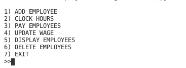

# EmployeeTracker
## Overview
This program uses Python and SQLite to insert and access a database holder information about employees. You have the option to add employees, clock hours, pay employees, update wages, display employees, and delete employees. All information is saved in the database for easy access.
## Development Environment
* VS Code
* Python 3.8.5
* SQLite 3

## Execution
To run put: 
```python
python3 main.py
``` 
The ouput is like this:   


You can then follow the steps to update your database.

## Useful Websites

* [Here](https://docs.python.org/3.8/) is the Python reference.
* [Here](https://www.sqlite.org/index.html) is the SQLite reference.
* [Here](https://stackoverflow.com) is Stack Overflow.
